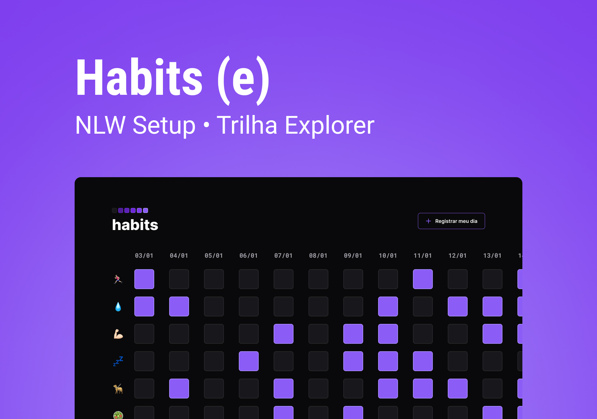

<h1 align="center"> HABITS </h1>

Aplicação desenvolvida durante a semana do evento NLW Setup (Trilha Explorer), da Rocketseat.  

  <a href="#-tecnologias">Tecnologias</a>&nbsp;&nbsp;&nbsp;|&nbsp;&nbsp;&nbsp;
  <a href="#-projeto">Projeto</a>&nbsp;&nbsp;&nbsp;|&nbsp;&nbsp;&nbsp;
  <a href="#-layout">Layout</a>

 

  

## 🚀 Tecnologias

Esse projeto foi desenvolvido com as seguintes tecnologias:

- HTML e CSS;
- JavaScript;
- Git e Github;
- Figma.

## 💻 Projeto

O Habits é uma aplicação que visa ajudar a rastrear os hábitos do usuário.

Acesse o site com constância e clique em "+ Registrar o meu dia" para selecionar as atividades realizadas ao longo dos dias.

- Para acessá-lo, basta entrar [aqui](https://freedomjuliana.github.io/nlw-setup/).

## 🔖 Layout

O template do projeto está disponível [NESTE LINK](https://www.figma.com/community/file/1195327109778210238). É necessário ter conta no [Figma](https://figma.com) para acessá-lo.

---

Feito com 💜 by Juliana Morais! :)
